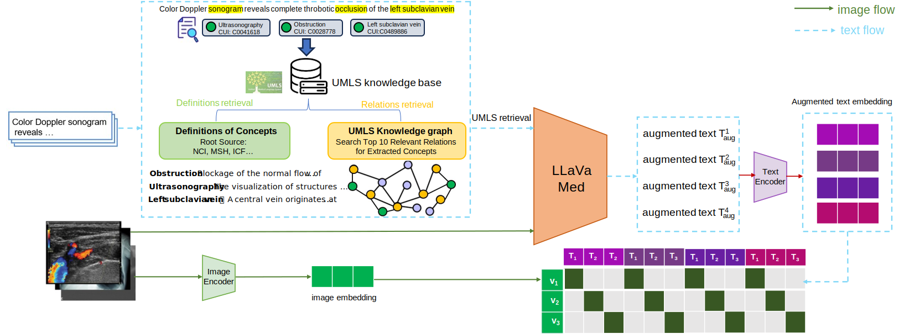

# RaceCLIP



This is the implemenation of RaceCLIP.
### Requirements

Run the following command to install the required packages:

```bash
pip install -r requirements.txt
```
### Offline UMLS knowledge retrieval
The term definitions and associated relationships can be retrieved via the [UMLS API](https://documentation.uts.nlm.nih.gov/rest/home.html) shown as following script: 

```angular2
python retrieval.py
```

### Retrieval augmented MLLM captioning

Please download [LLaVa-Med](https://huggingface.co/microsoft/llava-med-v1.5-mistral-7b) before recaptioning the [ROCO](https://github.com/razorx89/roco-dataset) dataset
The detailed usage of LLaVa-Med is available via the official repository provided by [Microsoft](https://github.com/microsoft/LLaVA-Med)

```angular2
python MLLM_captioning.py
```

### Multi-text contrastive learning
Now you can start to fine-tune the model from pulicly available weights pretrained by [OpenAI](https://openaipublic.azureedge.net/clip/models/5806e77cd80f8b59890b7e101eabd078d9fb84e6937f9e85e4ecb61988df416f/ViT-B-16.pt) using multi-text contrastive loss:

```angular2
python main.py
```

### Dataset description
This framework recaptions ROCO dataset with the integration of expert knowledge from the medical knowledge base UMLS.
Each image in the recaptioned dataset is paired with 4 various augmented captions. [Details](https://www.dropbox.com/scl/fo/wgqaeeyus8mkn4snd7b55/AEWp3wGv8PazetduAC4nNsM?rlkey=xttkwvncqfjri962jt5coro9c&st=n7xrpkiw&dl=0)


## Acknowledgement

The implementation of RaceCLIP is based on [MedGemma-1.5]([https://github.com/microsoft/LLaVA-Med](https://huggingface.co/google/medgemma-1.5-4b-it), [CLIP](https://github.com/OpenAI/CLIP) and [UMLS API](https://documentation.uts.nlm.nih.gov/rest/home.html).
We thank the authors for their open-sourced code and encourage users to cite their works when applicable.

